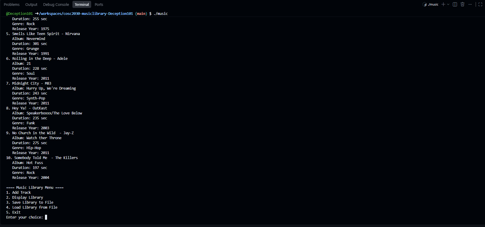

# Music Library

An app in C++ that lets you add music tracks, view them, and save/load 
them from a file so the data continues between runs.

## Features

- Add a track (title, artist, album, duration, genre, release year)
- Display all tracks currently loaded
- Save the library to `musiclibrary.dat`
- Load the library back from `musiclibrary.dat`

## How to Run

Build with: g++ main.cpp -o main
Run with: ./main

Use the menu to add tracks, save them, and load them later.

## Sample Run

